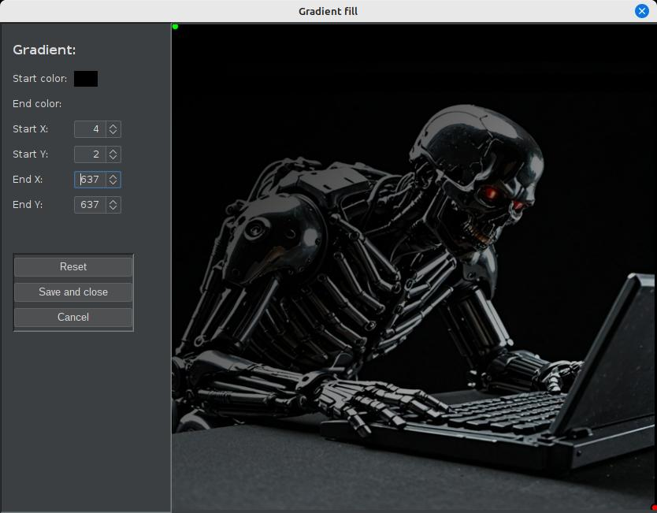
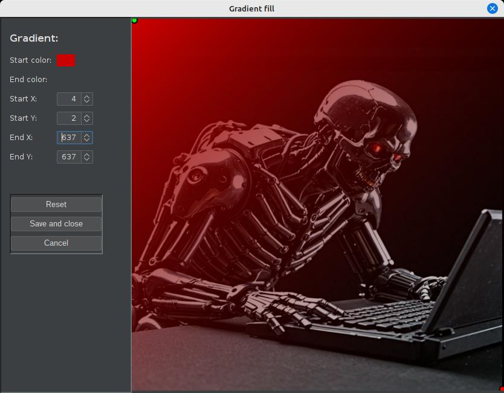
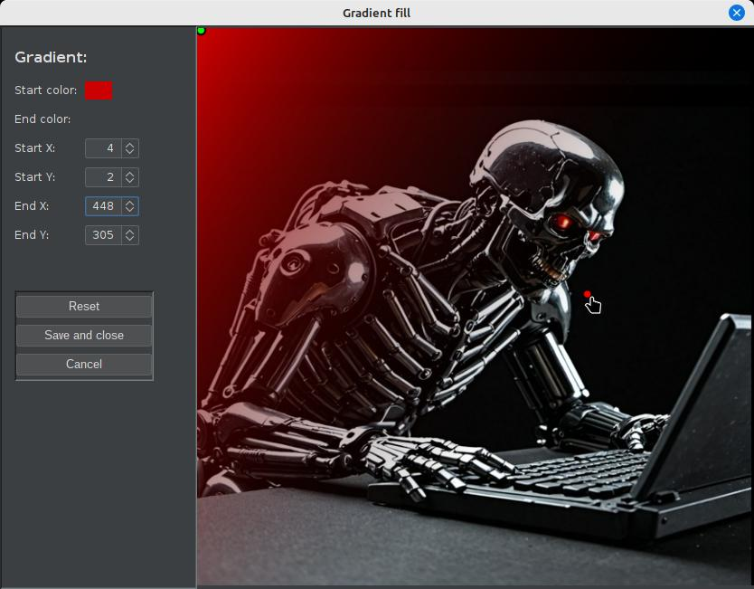
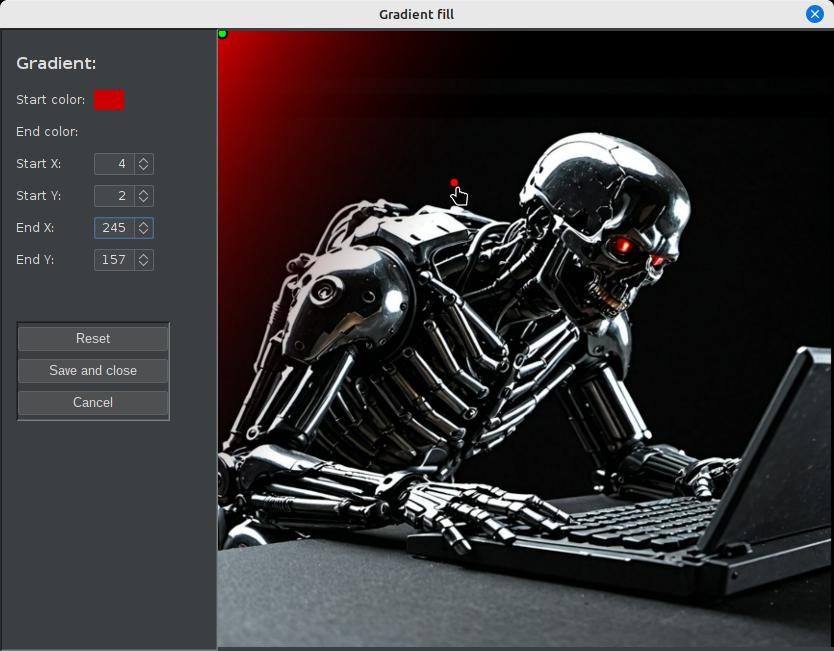
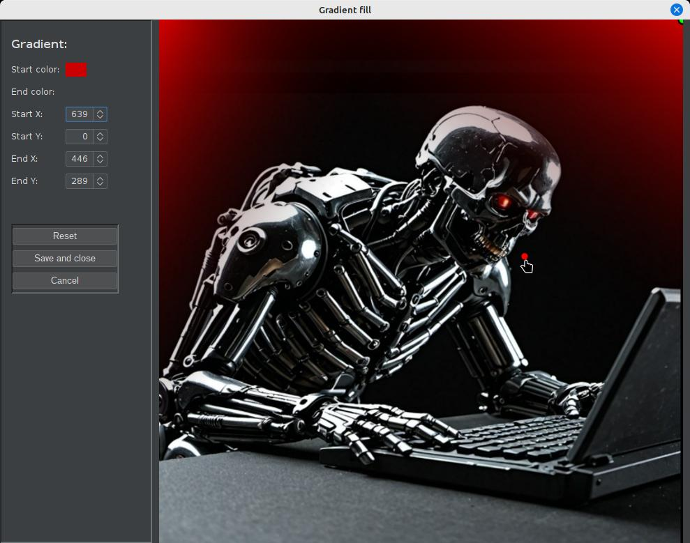

# ext-iv-gradient-fill
An extension for ImageViewer to allow highly customizable gradient fills on supported images.

## What is this?

This is an extension for the [ImageViewer](https://github.com/scorbo2/imageviewer) application that allows you to apply a gradient fill to the selected image.

## How do I get it?

### Option 1: automatic download and install

Visit the "Available" tab in the extension manager dialog. Select "Gradient fill" from the list on the
left and then hit the "Install" button in the top right.
If you decide later to remove the extension, come back to the extension manager dialog, select "Gradient fill"
from the list on the left, and hit the "Uninstall" button in the top right. The application will prompt to restart.
It's just that easy!

### Option 2: manual download and install

You can manually download the extension jar:
[ext-iv-gradient-fill-3.3.0.jar](https://www.corbett.ca/apps/ImageViewer/extensions/3.3/ext-iv-gradient-fill-3.3.0.jar)

Save it to your ~/.ImageViewer/extensions directory and restart the application.

### Option 3: build from source

You can clone this repo and build the extension jar with Maven (Java 17 or higher required):

```shell
git clone https://github.com/scorbo2/ext-iv-gradient-fill.git
cd ext-iv-gradient-fill
mvn package

# Copy the result to extensions dir:
cp target/ext-iv-gradient-fil-3.3.0.jar ~/.ImageViewer/extensions/
```

## Okay, it's installed, now how do I use it?

Once ImageViewer has restarted, browse to any image. Let's start with a scary robot image:


It's okay, but the plain back background doesn't give us that "menacing" feeling that we're going for.
Wouldn't it be nice if we could add a subtle deep red gradient to the background? Let's select "Gradient fill"
from the "Edit" menu, or hit `ctrl+shift+g` on the keyboard. This brings up the Gradient Fill dialog:



Hmm, that doesn't look very good with default settings. Let's click the black color swatch next to "Start color"
and change it to deep red (204,0,0):



Okay, that's somewhat better. But by default, the gradient runs diagonally across the entire image, from the
green start point in the top left corner to the red end point in the bottom right corner. Both of these points
are click-and-draggable, so let's move the red end point to just to the lower right of the robot's head:



Okay, that's a little better, but the gradient is still a bit too strong. Let's drag the red dot to just to the
upper left of the robot's head:



Great! But wouldn't it be nice if we could also have a gradient coming in from the top right as well? We can!
Click "Save and close" to commit these changes, then bring up the Gradient Fill dialog again.
Now, select the same deep red start color, and drag the green start point to the top right corner.
Now, drag the red end point to just to the lower right of the robot's head:



Excellent! Click "Save and close" again, and now we can see the final image:


Creepy!

Note that the "end color" is fully transparent by default. This is the best option for overlaying a gradient
on top of an existing image, as we did above. But you can set start and end to any colors you like, and play
with the positioning of the start and end points to create various effects. Be aware that if your source image
is a JPEG image, you will lose transparency when saving the image, as JPEG does not support transparency.
If you want to preserve transparency, start with a PNG image. The alpha channel (transparency) will then be preserved
automatically when you save your changes.

## Notes

Gradient filling is currently only supported for jpeg and png images.

## Requirements

Compatible with any ImageViewer 3.x release.

## License

ImageViewer and this extension are made available under the MIT license: https://opensource.org/license/mit
